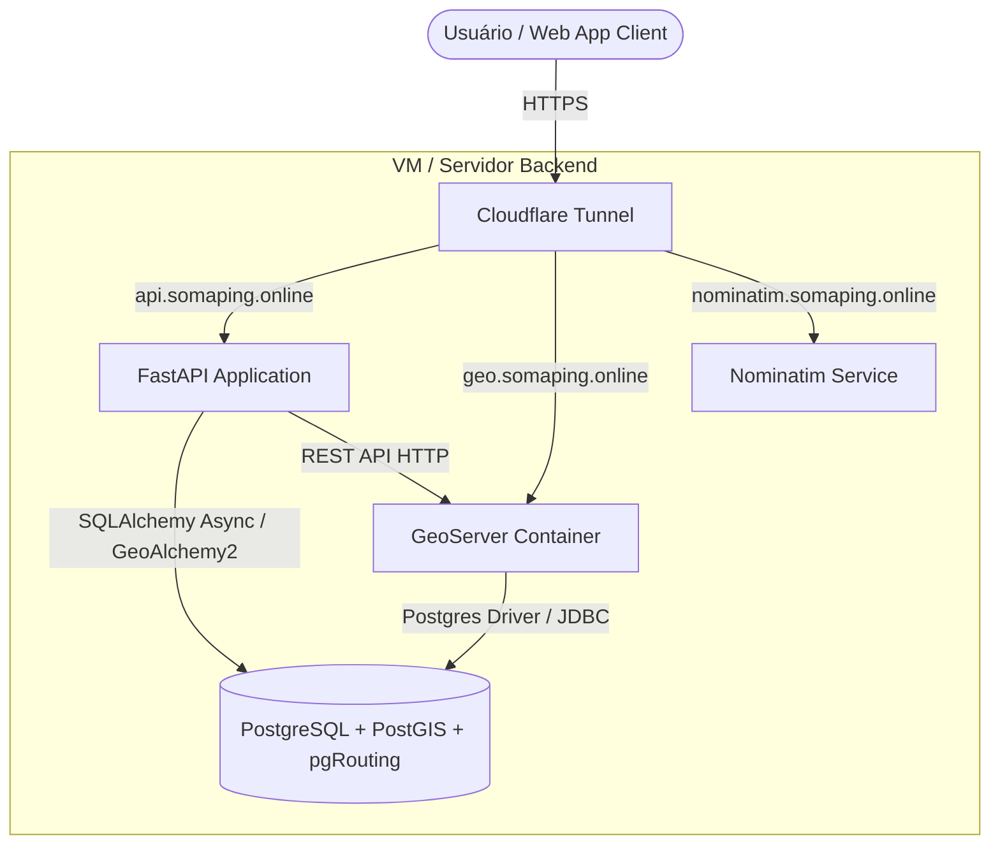

# SOMAP Backend — WebGIS Corporativo

Este repositório contém o backend do **SOMAP**, um sistema WebGIS corporativo robusto projetado para visualização, manipulação e análise de dados geoespaciais, além de roteamento de redes viárias. O projeto foi construído para servir como um motor geográfico eficiente, integrando banco de dados espacial, roteamento topológico e servidores de mapas clássicos.

---

## 🏗️ Arquitetura de Referência e Componentes

O backend do SOMAP é modular e distribuído em contêineres Docker, permitindo a separação clara entre a API lógica, o banco de dados espacial e os serviços cartográficos. 

A arquitetura do sistema funciona sob o seguinte fluxo de componentes:



---

## 🛠️ Stack Tecnológica

*   **Linguagem & Execução**: Python 3.12 (Slim-based)
*   **Web Framework**: **FastAPI** — Escolhido por sua performance assíncrona nativa, validação rigorosa de payloads via **Pydantic v2** e geração automática de especificações OpenAPI.
*   **Banco de Dados Espacial**: **PostgreSQL 16** com extensões:
    *   **PostGIS (v3.4)**: Armazenamento e indexação de geometrias complexas (GiST) e consultas espaciais de alta performance.
    *   **pgRouting (v3.6)**: Motor de grafo para cálculo de rotas sobre redes topológicas de transporte.
*   **Acesso a Dados (ORM)**: **SQLAlchemy 2.0** no modelo assíncrono utilizando o driver **asyncpg**, estendido com **GeoAlchemy2** para integração fluida de colunas espaciais (`Geometry`).
*   **Migrações de Banco**: **Alembic** para controle de versão evolutivo do schema relacional e de tipos enumerados.
*   **Serviço de Mapas (Web Map Servers)**: **GeoServer 2.25.0** (Kartoza) para renderização de tiles cartográficos WMS, WFS e encapsulamento de camadas.
*   **Infraestrutura de Rede e Exposição**: **Cloudflare Tunnel (`cloudflared`)** para comunicação e tunelamento seguro entre a infraestrutura local/virtualizada e a web, sem exposição direta de portas no firewall público.

---

## 📁 Estrutura de Pastas do Projeto

A estrutura de código segue as melhores práticas para aplicações FastAPI estruturadas por camadas lógicas:

```
somap-backend/
├── alembic/                  # Scripts e histórico de migrações do banco
├── app/                      # Código-fonte principal da API FastAPI
│   ├── models/               # Modelos SQLAlchemy/GeoAlchemy2 (Mapeamento de tabelas)
│   ├── routers/              # Endpoints HTTP organizados por recursos
│   ├── schemas/              # Modelos Pydantic (Validação de entrada/saída)
│   ├── services/             # Regra de negócio (Integrações com Banco, GeoServer e pgRouting)
│   ├── config.py             # Definição e parse de variáveis de ambiente
│   ├── database.py           # Inicialização da engine assíncrona SQLAlchemy
│   ├── dependencies.py       # Injeções de dependência (Sessões de banco, autenticação, RBAC)
│   └── main.py               # Arquivo principal e inicialização do ciclo FastAPI
├── cloudflared/              # Configurações do túnel Cloudflare
├── scripts/                  # Scripts auxiliares (Seeding do banco, setup inicial do GeoServer)
├── Dockerfile                # Receita de build do container da API Python
├── Dockerfile.db             # Receita da base de dados (PostgreSQL + PostGIS + pgRouting)
└── docker-compose.yml        # Orquestração local dos serviços do sistema
```

---

## 🚦 Endpoints e Interface da API

A API expõe serviçosREST divididos logicamente em quatro rotas principais:

| Recurso | Rota | Método | Autenticação / Papel | Descrição |
| :--- | :--- | :--- | :--- | :--- |
| **Auth** | `/api/auth/login` | `POST` | Pública | Valida credenciais e gera o Token JWT para controle de sessões. |
| **Workspaces** | `/api/workspaces` | `GET` | Autenticado | Lista todos os espaços de trabalho (workspaces) ativos na plataforma. |
| **Layers** | `/api/layers` | `GET` | Autenticado | Lista as camadas temáticas ativas associadas a um `workspaceId`. |
| **Layers** | `/api/layers/{layer_id}/data` | `GET` | Autenticado | Retorna dados geográficos nativos da camada em formato GeoJSON (`FeatureCollection`). |
| **Layers** | `/api/layers/{layer_id}` | `PATCH` | `admin` \| `editor` | Atualiza parâmetros operacionais da camada (estilo, opacidade, visibilidade, zIndex). |
| **Routing** | `/api/v1/routes` | `POST` | Autenticado | Computa a rota mais curta com base no motor espacial pgRouting. |

---

## 📐 Modelagem de Dados Espaciais e Relacionais

O banco de dados do SOMAP é composto por tabelas relacionais de controle administrativo e dados geográficos nativos.

### 1. Entidades do Core

*   **Users (`users`)**:
    Controla o acesso à plataforma utilizando o mecanismo RBAC (Role-Based Access Control) por meio dos seguintes níveis de permissão (`UserRole`):
    *   `admin`: Controle completo sobre camadas, espaços e segurança.
    *   `editor`: Permissão para editar parâmetros e visibilidade de camadas espaciais.
    *   `viewer`: Apenas visualização de dados geográficos e workspaces.

*   **Workspaces (`workspaces`)**:
    Proporciona contextos lógicos isolados por região de negócio ou área geográfica de atuação (ex: Região Sul, Região Sudeste), organizando coleções de mapas.

*   **Layers (`layers`)**:
    Abstrai os diferentes tipos de dados espaciais disponíveis no GIS. Suporta nativamente:
    *   `xyz`: Camadas base de mapas (ex: OpenStreetMap).
    *   `wms` / `wfs`: Integração com servidores cartográficos como o GeoServer para renderização e obtenção dinâmica de features.
    *   `geojson`: Dados vetoriais indexados diretamente na tabela `layers` por meio de uma coluna geométrica.
    
    A tabela contém uma coluna espacial nativa PostGIS `geometry` do tipo `Geometry(GEOMETRY, 4326)`, indexada através de um índice espacial **GiST** (`ix_layers_geometry`) para consultas por proximidade, bounding-box (`bbox`) e intersecção rápida.

---

## 🗺️ Integrações Geográficas Avançadas

### 🔄 Provisionamento no GeoServer
O backend conta com um módulo de integração administrativa com o GeoServer (`GeoServerService`). Ele interage com a API administrativa REST do GeoServer para:
1.  Criar novos workspaces no servidor geográfico.
2.  Registrar fontes de dados PostGIS (`PostGIS DataStore`) que apontam para o banco relacional do SOMAP.
3.  Publicar de forma automatizada tabelas geográficas como recursos (`FeatureType`) do tipo WMS/WFS.

### 🚗 Roteamento com pgRouting
O módulo de rotas realiza cálculos de caminho mínimo sobre redes viárias topológicas. 
*   **Procedimento de Cálculo**:
    1.  Recebe coordenadas de origem e destino em formato `[longitude, latitude]`.
    2.  Procura os nós viários mais próximos no grafo da base de dados (`sul_2po_vertices`) usando operadores espaciais de distância PostGIS (`<->`).
    3.  Executa o algoritmo de Dijkstra (`pgr_dijkstra`) dinamicamente sobre uma subquery espacial otimizada com a bounding box contendo a origem/destino expandida (`ST_Expand` / `ST_MakeLine`), mitigando gargalos de processamento.
    4.  Associa o caminho topológico resultante com a tabela de arcos físicos (`sul_2po_4pgr`) para recuperar a geometria original do traçado (`geom_way`).
    5.  Monta o resultado no formato **GeoJSON** (`FeatureCollection`) contendo as propriedades e os custos agregados de viagem.
