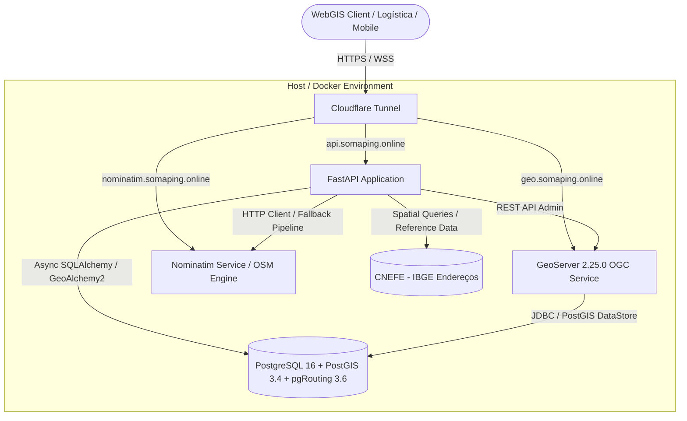

# SOMAP Backend — WebGIS & Spatial Engine Lab

[](https://fastapi.tiangolo.com/)
[](https://www.postgresql.org/)
[](https://postgis.net/)
[](https://pgrouting.org/)
[](https://geoserver.org/)
[](https://www.docker.com/)
[](https://www.cloudflare.com/)

> 🚀 **Laboratório de Engenharia Geoespacial & Portfólio GIS**: Este projeto é meu ambiente prático de desenvolvimento WebGIS e experimentação de arquiteturas espaciais com stack 100% open-source. O objetivo é demonstrar a aplicação real de padrões OGC, roteamento em grafos topológicos, geocodificação resiliente com bases oficiais brasileiras (CNEFE/IBGE + OSM) e processamento vetorial assíncrono de alta performance.

---

## 🧭 Visão Geral

O **SOMAP Backend** é uma API geoespacial corporativa concebida para fornecer a infraestrutura de dados e inteligência geográfica a clientes WebGIS e módulos de operação logística. Ele atua como um motor de processamento espacial, orquestrando desde o armazenamento relacional-topológico no PostgreSQL/PostGIS até o cálculo de rotas em grafos viários via pgRouting, integração automatizada com servidores OGC (GeoServer) e pipelines de geocodificação em camadas.

### 🎯 Principais Desafios e Competências GIS Aplicadas
- **Modelagem Topológica de Redes**: Criação e indexação de grafos viários a partir de malhas viárias complexas (OpenStreetMap via `osm2po`) para roteamento viário com restrições e custos reais.
- **Consultas Espaciais Otimizadas**: Utilização de indexação espacial GiST, operadores k-NN (`<->`) para busca de nós mais próximos e restrição dinâmica de Bounding Box (`ST_Expand`) com `pgr_dijkstra`.
- **Interoperabilidade de Padrões OGC**: Publicação e consumo automatizado de serviços de mapas WMS, WFS e camadas de tiles XYZ.
- **Geocodificação Híbrida & Resiliente**: Estratégia multi-tier integrando Nominatim local/remoto, base de endereços estatísticos do IBGE (CNEFE) e fallbacks com heurísticas regionais.
- **Arquitetura Assíncrona Geo-Enabled**: FastAPI + SQLAlchemy 2.0 Async + GeoAlchemy2 + asyncpg para alta escalabilidade em operações I/O intensivas.

---

## 🏗️ Arquitetura de Referência

A arquitetura do ecossistema é totalmente containerizada e distribuída em camadas desacopladas, expondo serviços através de túneis seguros:


```mermaid
graph TD
    Client([WebGIS Client / Logística / Mobile]) -->|HTTPS / WSS| Cloudflare[Cloudflare Tunnel]
    
    subgraph Host / Docker Environment
        Cloudflare -->|api.somaping.online| API[FastAPI Application]
        Cloudflare -->|geo.somaping.online| GeoServer[GeoServer 2.25.0 OGC Service]
        Cloudflare -->|nominatim.somaping.online| Nominatim[Nominatim Service / OSM Engine]
        
        API -->|Async SQLAlchemy / GeoAlchemy2| DB[(PostgreSQL 16 + PostGIS 3.4 + pgRouting 3.6)]
        API -->|REST API Admin| GeoServer
        API -->|HTTP Client / Fallback Pipeline| Nominatim
        API -->|Spatial Queries / Reference Data| CNEFE[(CNEFE - IBGE Endereços)]
        
        GeoServer -->|JDBC / PostGIS DataStore| DB
    end
```

---

## 🛠️ Stack Tecnológica & Decisões de Engenharia

| Componente | Tecnologia | Decisão Técnica / Aplicação |
| :--- | :--- | :--- |
| **Backend Framework** | **FastAPI** (Python 3.12) | Execução assíncrona de alto throughput, serialização nativa Pydantic v2 e documentação OpenAPI interativa. |
| **Banco de Dados Espacial** | **PostgreSQL 16 + PostGIS 3.4** | Suporte a tipos geométricos (`GEOMETRY`, `MULTILINESTRING`, `POINT`), indexação espacial **GiST** e funções analíticas espaciais nativas. |
| **Motor de Grafos e Rotas** | **pgRouting 3.6** | Algoritmos de caminho mínimo (`pgr_dijkstra`) sobre rede viária topológica com cálculo de custo em distância e tempo. |
| **Acesso a Dados (ORM)** | **SQLAlchemy 2.0 + GeoAlchemy2 + asyncpg** | Mapeamento relacional assíncrono com suporte nativo a colunas espaciais e operações PostGIS em Python. |
| **Serviço de Mapas (OGC)** | **GeoServer 2.25.0 (Kartoza)** | Renderização de mapas via WMS/WFS, gerenciamento de workspaces, DataStores dinâmicos e controle de estilo SLD. |
| **Geocodificação & Endereçamento** | **Nominatim + CNEFE/IBGE Gateway** | Resolução de endereços em cascata com apoio dos dados oficiais do CNEFE (IBGE) e OpenStreetMap. |
| **Migrações e Schema** | **Alembic** | Versionamento evolutivo do banco de dados espacial e relacionamentos multi-tenant. |
| **Infraestrutura e Segurança** | **Cloudflare Tunnel (`cloudflared`)** | Publicação segura na web via túnel criptografado sem necessidade de abrir portas no roteador/firewall. |

---

## 🧩 Principais Módulos do Sistema

### 1. 📍 Gateway de Geocodificação Híbrido & Fallback (CNEFE / Nominatim)
O pipeline de geocodificação foi projetado com resiliência para lidar com as particularidades de endereçamento no Brasil:


```mermaid
flowchart TD
    Req([Endereço em Texto]) --> Clean{Texto Válido?}
    Clean -- Não --> Null[Retorna Nulo / Padrão]
    Clean -- Sim --> NominatimLocal[1. Nominatim Local / Dedicado]
    
    NominatimLocal -- Encontrado --> Found[Coordenadas Lat/Lon]
    NominatimLocal -- Não Encontrado --> CNEFE[2. Base de Endereços CNEFE - IBGE / OSM Global]
    
    CNEFE -- Encontrado --> Found
    CNEFE -- Não Encontrado --> Heuristic[3. Heurística Regional + Município]
    
    Heuristic -- Encontrado --> Found
    Heuristic -- Falha --> Fallback[4. Coordenadas Operacionais de Contingência]
    Fallback --> Warning[Registra Warning & Retorna Coordenada Segura]
```

- **Múltiplos Provedores**: Tenta resolver via instâncias locais do Nominatim, OpenStreetMap público e base oficial do **CNEFE (Cadastro Nacional de Endereços para Fins Estatísticos - IBGE)**.
- **Heurística Regional**: Detecta ausência de dados municipais e anexa metadados contextuais (ex: Curitiba/PR) para desambiguação espacial.
- **Fallback Operacional**: Garante que indisponibilidades pontuais de provedores externos não quebrem o fluxo de roteirização logística, emitindo *warnings* rastreáveis.

---

### 2. 🚗 Motor de Roteamento Topológico (pgRouting)
Diferente de APIs que utilizam roteamento como caixa-preta, o SOMAP implementa o cálculo direto no banco espacial:

1. **Localização de Nós por k-NN**: Localiza os vértices mais próximos da rede viária (`sul_2po_vertices`) usando o operador de distância indexada GiST (`<->`).
2. **Subgrafo Dinâmico (BBox Otimizada)**: Para evitar varreduras lentas no grafo estadual/regional completo, o algoritmo restringe o escopo de arestas (`sul_2po_4pgr`) com `ST_Expand(ST_MakeLine(...), 0.25)`.
3. **Caminho Mínimo (Dijkstra)**: Executa `pgr_dijkstra` extraindo custos agregados (km e horas) e reconstituindo a geometria contínua com `ST_LineMerge(ST_Union(geom_way))`.
4. **Exportação GeoJSON**: Retorna o traçado consolidado em formato GeoJSON `FeatureCollection` ou `MultiLineString`.

---

### 3. 📦 Módulo de Orquestração Logística e Despacho
Permite gerenciar operações de campo, coletas e entregas multi-paradas:

- **Roteirização Multi-Ponto**: Monta percursos partindo de uma base de origem (HQ), passando por múltiplos pontos de coleta/entrega intermediários e retornando à sede.
- **Persistência PostGIS**: Grava a rota calculada na tabela `logistics_routes` (geometria `MultiLineString`) e cada parada na tabela `logistics_route_stops` (geometria `Point`).
- **Despacho Automático**: Computa métricas de tempo/distância total e gera links de navegação *turn-by-turn* formatados para o **Google Maps** e relatórios prontos para envio via WhatsApp para motoristas.

---

### 4. 🗺️ Integração Automatizada com GeoServer
O serviço `GeoServerService` automatiza a governança cartográfica via REST API:
- Criação dinâmica de Workspaces isolados.
- Registro de `PostGIS DataStore` apontando diretamente para as tabelas do PostgreSQL.
- Publicação automatizada de tabelas e views espaciais como camadas WMS/WFS consumíveis por qualquer cliente GIS (QGIS, OpenLayers, MapLibre, Leaflet).

---

## 🚦 Endpoints e Interface da API

| Recurso | Rota | Método | Permissão | Descrição |
| :--- | :--- | :--- | :--- | :--- |
| **Auth** | `/api/auth/login` | `POST` | Pública | Autenticação com credenciais e emissão de JWT Token. |
| **Auth** | `/api/auth/me` | `GET` | Autenticado | Retorna dados do usuário autenticado e seus workspaces associados. |
| **Workspaces**| `/api/workspaces` | `GET` | Autenticado | Lista os workspaces disponíveis de acordo com o perfil do usuário. |
| **Layers** | `/api/layers` | `GET` | Autenticado | Lista camadas ativas associadas a um determinado `workspaceId`. |
| **Layers** | `/api/layers/{layer_id}/data` | `GET` | Autenticado | Retorna os dados vetoriais da camada em formato GeoJSON nativo. |
| **Layers** | `/api/layers/{layer_id}` | `PATCH` | `admin` \| `editor` | Atualiza parâmetros operacionais (visibilidade, opacidade, z-index, estilo). |
| **Routing** | `/api/v1/routes` | `POST` | Autenticado | Calcula a menor rota entre dois pontos via pgRouting (retorna GeoJSON + custo). |
| **Logistics** | `/api/v1/logistics/trigger` | `POST` | Autenticado / API | Orquestra roteirização multi-paradas, geocodificação, persistência PostGIS e despacho. |
| **Health** | `/health` | `GET` | Pública | Healthcheck para monitoramento de liveness e tunelamento Cloudflare. |

---

## 📁 Estrutura de Diretórios

```
somap-backend/
├── alembic/                  # Migrações versionadas do schema espacial
├── app/                      # Código-fonte principal da aplicação
│   ├── models/               # Modelos SQLAlchemy + GeoAlchemy2 (User, Workspace, Layer, Logistics)
│   ├── routers/              # Controllers HTTP (auth, layers, workspaces, routing, logistics)
│   ├── schemas/              # Modelos de validação Pydantic v2
│   ├── services/             # Lógica de negócio espacial (GeoServer, Routing, Auth)
│   ├── config.py             # Configurações e variáveis de ambiente
│   ├── database.py           # Conexão assíncrona ao PostgreSQL
│   ├── dependencies.py       # Injeções de dependência, segurança e RBAC
│   └── main.py               # Instanciação da FastAPI e middlewares CORS
├── cloudflared/              # Configurações do túnel seguro Cloudflare
├── scripts/                  # Automações de apoio e scripts operacionais
│   ├── seed.py               # Povoamento inicial de usuários, workspaces e camadas
│   ├── geoserver_setup.py    # Provisionamento automático de camadas no GeoServer
│   ├── logistics_automation.py # Pipeline de despacho e roteirização em lote
│   └── tunnel_start.sh       # Script de inicialização do túnel de rede
├── Dockerfile                # Imagem Docker da API FastAPI (Python 3.12)
├── Dockerfile.db             # Imagem customizada PostgreSQL + PostGIS + pgRouting
└── docker-compose.yml        # Orquestração multicontêiner do ambiente
```

---

## ⚙️ Como Executar o Projeto

### Pré-requisitos
- **Docker** e **Docker Compose** instalados.
- Arquivo `.env` configurado na raiz (utilize `.env.example` como base).

### 1. Inicializar os Contêineres
```bash
# Subir banco espacial, API e GeoServer
docker compose up -d --build
```

### 2. Aplicar Migrações de Banco de Dados
```bash
# Executar as migrações do Alembic dentro do container da API
docker compose exec api alembic upgrade head
```

### 3. Popular Dados de Teste (Seed)
```bash
# Cadastrar workspaces, camadas base e usuários padrão
docker compose exec api python -m scripts.seed
```

### 4. Provisionar Camadas no GeoServer (Opcional)
```bash
# Configurar Workspace e DataStores automaticamente no GeoServer
docker compose exec api python -m scripts.geoserver_setup
```

### 5. Executar a Automação Logística de Demonstração
```bash
# Executar o fluxo completo de despacho e cálculo de rotas
docker compose exec api python -m scripts.logistics_automation
```

---

## 🧪 Acesso aos Serviços

- **API Swagger / OpenAPI**: `http://localhost:8000/docs`
- **GeoServer Web Admin**: `http://localhost:8080/geoserver`
- **PostgreSQL / PostGIS**: `localhost:5432`

---

## 👤 Autor & Propósito

Desenvolvido por **Silas Nascimento** como laboratório contínuo de experimentação e portfólio em **Desenvolvimento GIS, Engenharia de Dados Espaciais e Arquitetura de Software Geoespacial**.

Fique à vontade para explorar os códigos, abrir *issues* ou sugerir melhorias! 🌍🛰️
