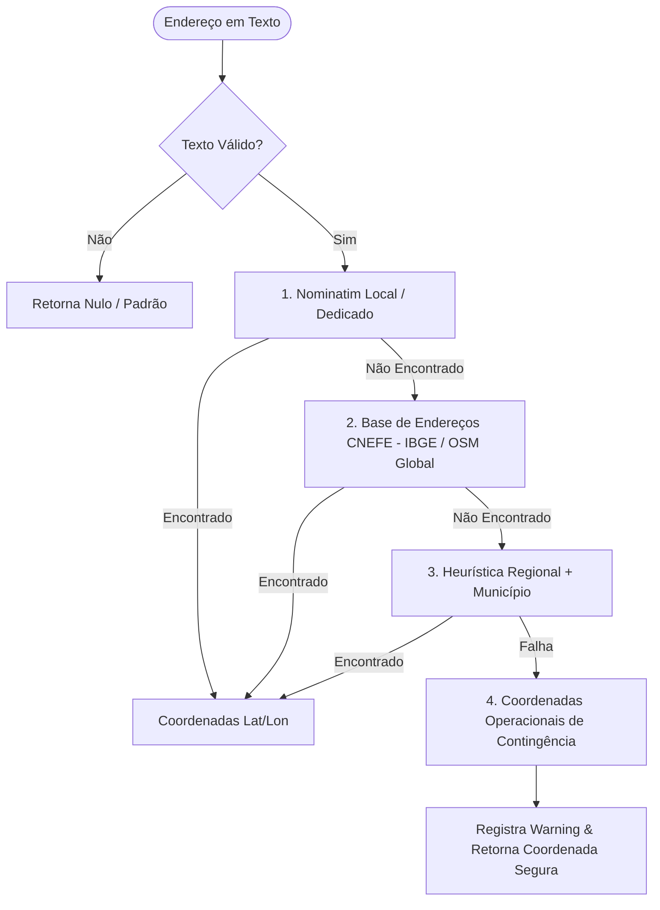

# SOMAP Backend — WebGIS, Spatial Engine & Spatial Data Governance

[](https://fastapi.tiangolo.com/)
[](https://www.postgresql.org/)
[](https://postgis.net/)
[](https://pgrouting.org/)
[](https://geoserver.org/)
[](https://qgis.org/)
[](https://www.docker.com/)
[](https://www.cloudflare.com/)

> 🚀 **Laboratório de Engenharia Geoespacial, IDE Corporativa & Portfólio GIS**: Este projeto é um ecossistema prático de desenvolvimento WebGIS, governança espacial multiusuário e experimentação de arquiteturas espaciais com stack 100% open-source de padrão industrial. O objetivo é demonstrar a aplicação real de padrões OGC, roteamento em grafos topológicos, geocodificação resiliente com bases oficiais brasileiras (CNEFE/IBGE + OSM), edição concorrente no QGIS Desktop via PostGIS com segurança granular militarizada (RLS/CLS) e processamento vetorial assíncrono de alta performance.

---

## 🧭 Visão Geral

O **SOMAP Backend** é uma plataforma e motor de dados espaciais corporativo concebido para atuar como a **Única Fonte da Verdade (Single Source of Truth - SSOT)** de uma Infraestrutura de Dados Espaciais (IDE / SDI). 

Ele conecta e orquestra de forma simultânea dois ecossistemas complementares:
1. **Ambiente Desktop Corporativo (QGIS + PostGIS)**: Edição multiusuário concorrente com controle transacional ACID, segurança granular em múltiplos níveis (Schema, Tabela, Coluna e Linha), automações espaciais por triggers no banco, auditoria completa e centralização de simbologias e projetos.
2. **Ambiente WebGIS & Logística (FastAPI + GeoServer + pgRouting)**: APIs assíncronas de alto rendimento para consumo de dados vetoriais (GeoJSON), orquestração logística com cálculo de rotas em grafos viários e publicação de serviços OGC interoperáveis (WMS, WFS).

### 🎯 Principais Desafios e Competências GIS Aplicadas
- **Governança Espacial & Edição Multiusuário (QGIS + PostGIS)**: Concorrência transacional sem travamento de arquivos, controle granular de acesso (RBAC, Row-Level Security - RLS, Column-Level Security - CLS), trilha de auditoria completa em `JSONB`, centralização de estilos (`layer_styles`) e projetos (`qgis_projects`).
- **Automação Espacial no Servidor (Triggers PostGIS)**: Cálculo automático de métricas geométricas (área em m², extensão em km com reprojeção dinâmica para projeções projetadas locais/UTM), carimbo automático de autoria (`CURRENT_USER`) e validação de integridade topológica (`ST_IsValid`).
- **Modelagem Topológica de Redes**: Criação e indexação de grafos viários a partir de malhas viárias complexas (OpenStreetMap via `osm2po`) para roteamento viário com restrições e custos reais.
- **Consultas Espaciais Otimizadas**: Utilização de indexação espacial GiST, operadores k-NN (`<->`) para busca de nós mais próximos e restrição dinâmica de Bounding Box (`ST_Expand`) com `pgr_dijkstra`.
- **Interoperabilidade de Padrões OGC**: Publicação e consumo automatizado de serviços de mapas WMS, WFS e camadas de tiles XYZ via GeoServer REST API.
- **Geocodificação Híbrida & Resiliente**: Estratégia multi-tier integrando Nominatim local/remoto, base de endereços estatísticos do IBGE (CNEFE) e fallbacks com heurísticas regionais.
- **Arquitetura Assíncrona Geo-Enabled**: FastAPI + SQLAlchemy 2.0 Async + GeoAlchemy2 + asyncpg para alta escalabilidade em operações I/O intensivas.

---

## 🏗️ Arquitetura de Referência

A arquitetura do ecossistema é totalmente containerizada e distribuída em camadas desacopladas, integrando clientes WebGIS, serviços de campo e estações GIS Desktop:

```mermaid
graph TB
    subgraph "Camada de Clientes & Operadores"
        WebClient([WebGIS Client / Logística / Mobile])
        QGISDesktop["💻 QGIS Desktop / Engenharia<br><i>(Múltiplos Editores Concorrentes)</i>"]
        FieldClient["📱 QField / Coleta em Campo<br><i>(Fiscais & Inspetores)</i>"]
    end

    subgraph "Borda & Tunelamento Seguro"
        Cloudflare[Cloudflare Tunnel]
    end

    WebClient -->|HTTPS / WSS| Cloudflare

    subgraph "Host / Docker Environment"
        Cloudflare -->|api.somaping.online| API[FastAPI Application]
        Cloudflare -->|geo.somaping.online| GeoServer[GeoServer 2.25.0 OGC Service]
        Cloudflare -->|nominatim.somaping.online| Nominatim[Nominatim Service / OSM Engine]

        API -->|Async SQLAlchemy / GeoAlchemy2| DB[(PostgreSQL 16 + PostGIS 3.4 + pgRouting 3.6)]
        API -->|REST API Admin| GeoServer
        API -->|HTTP Client / Fallback Pipeline| Nominatim
        API -->|Spatial Queries / Reference Data| CNEFE[(CNEFE - IBGE Endereços)]

        GeoServer -->|JDBC / PostGIS DataStore| DB
    end

    subgraph "Governança & Segurança PostGIS"
        QGISDesktop -->|PostGIS Provider (Direct DB Session)| DB
        FieldClient -->|PostGIS Provider / Sync| DB
    end
```

---

## 🛠️ Stack Tecnológica & Decisões de Engenharia

| Componente | Tecnologia | Decisão Técnica / Aplicação |
| :--- | :--- | :--- |
| **Banco de Dados Espacial** | **PostgreSQL 16 + PostGIS 3.4** | Suporte a tipos geométricos (`GEOMETRY`, `MULTILINESTRING`, `POLYGON`, `POINT`), indexação espacial **GiST**, triggers em C/PLpgSQL e funções analíticas nativas. |
| **Governança & Segurança de Dados** | **PostgreSQL RLS, CLS & Audit Trails** | Segurança militarizada por linha (Row-Level Security), proteção de colunas sensíveis (Column-Level Security) e auditoria transacional com diff `JSONB` (`OLD`/`NEW`). |
| **GIS Desktop & IDE Corporativa** | **QGIS 3.x + PostGIS Data Provider** | Edição vetorial concorrente multiusuário, repositório centralizado de estilos (`public.layer_styles`) e projetos de mapa corporativos (`qgis_projects`). |
| **Backend Framework** | **FastAPI** (Python 3.12) | Execução assíncrona de alto throughput, serialização nativa Pydantic v2 e documentação OpenAPI interativa. |
| **Motor de Grafos e Rotas** | **pgRouting 3.6** | Algoritmos de caminho mínimo (`pgr_dijkstra`) sobre rede viária topológica com cálculo de custo em distância e tempo. |
| **Acesso a Dados (ORM)** | **SQLAlchemy 2.0 + GeoAlchemy2 + asyncpg** | Mapeamento relacional assíncrono com suporte nativo a colunas espaciais e operações PostGIS em Python. |
| **Serviço de Mapas (OGC)** | **GeoServer 2.25.0 (Kartoza)** | Renderização de mapas via WMS/WFS, gerenciamento de workspaces, DataStores dinâmicos e controle de estilo SLD. |
| **Geocodificação & Endereçamento** | **Nominatim + CNEFE/IBGE Gateway** | Resolução de endereços em cascata com apoio dos dados oficiais do CNEFE (IBGE) e OpenStreetMap. |
| **Migrações e Schema** | **Alembic** | Versionamento evolutivo do banco de dados espacial e relacionamentos multi-tenant. |
| **Infraestrutura e Segurança** | **Cloudflare Tunnel (`cloudflared`)** | Publicação segura na web via túnel criptografado sem necessidade de abrir portas no roteador/firewall. |

---

## 🧩 Principais Módulos do Sistema

### 1. 🛡️ Governança Geoespacial & Edição Multiusuário (QGIS + PostGIS)
Substitui o modelo tradicional de arquivos estáticos (*Shapefiles* ou *GeoPackages* locais com conflitos de cópias) por uma infraestrutura centralizada com governança ativa no banco:

- **Edição Simultânea & Concorrência Transacional**: Múltiplos profissionais editam o mesmo trecho geográfico simultaneamente no QGIS. As operações são protegidas por transações ACID do PostgreSQL, garantindo integridade sem corromper arquivos.
- **Matriz de Segurança Granular em 4 Níveis**:
  - **Por Schema**: Isolamento departamental por domínios temáticos (ex: infraestrutura, ambiental, fundiário, limites). Schemas restritos (ex: `admin`, `audit`) são inacessíveis para operadores comuns.
  - **Por Tabela**: Controle estrito de privilégios (`SELECT`, `INSERT`, `UPDATE`, `DELETE`) gerenciados via Roles de grupo e herança de usuários.
  - **Por Coluna (Column-Level Security - CLS)**: Blindagem de atributos sensíveis. Permite que um fiscal atualize apenas campos de vistoria/notas, sendo tecnicamente impedido de alterar a geometria ou metadados de propriedade.
  - **Por Linha (Row-Level Security - RLS)**: Filtragem dinâmica de feições com base no usuário logado (`CURRENT_USER`). Editores visualizam e editam apenas suas próprias ordens de serviço/registros, enquanto gestores e administradores visualizam o consolidado completo.
- **Automação Espacial no Servidor (Triggers PostGIS)**:
  - Ao salvar feições no QGIS, triggers recalculam instantaneamente extensões (`ST_Length`) e áreas (`ST_Area`) com reprojeção automática para a projeção cartográfica correta (ex: UTM / SIRGAS 2000).
  - Autoria e datação automática e inalterável (`created_by = CURRENT_USER`, `created_at`, `updated_at`).
  - Validação estrita de integridade e validade topológica (`ST_IsValid`).
- **Trilha de Auditoria Completa (Schema `audit`)**:
  - Captura automática de qualquer `INSERT`, `UPDATE` ou `DELETE` com gravação do estado anterior (`OLD`) e posterior (`NEW`) em formato `JSONB`, usuário responsável e timestamp em milissegundos.
- **Governança Centralizada de Simbologia e Projetos**:
  - **Repositório Central de Estilos (`public.layer_styles`)**: A simbologia corporativa padrão das camadas é carregada automaticamente ao abrir as tabelas no QGIS, com escrita bloqueada para não-admins.
  - **Projetos Centralizados no Banco (`qgis_projects`)**: Modelos de projetos `.qgz` com pranchas de impressão padronizadas são versionados no próprio PostGIS, eliminando caminhos quebrados de arquivos em rede.
- **Compartilhamento Dinâmico de Camadas (`ALTER DEFAULT PRIVILEGES`)**:
  - Camadas criadas por membros de um grupo em schemas compartilhados nascem automaticamente acessíveis para leitura e edição pelos colegas de equipe.

---

### 2. 📍 Gateway de Geocodificação Híbrido & Fallback (CNEFE / Nominatim)
O pipeline de geocodificação foi projetado com resiliência para lidar com as particularidades de endereçamento no Brasil:


```mermaid
flowchart TD
    Req([Endereço em Texto]) --> Clean{Texto Válido?}
    Clean -- Não --> Null[Retorna Nulo / Padrão]
    Clean -- Sim --> NominatimLocal[1. Nominatim Local / Dedicado]
    
    NominatimLocal -- Encontrado --> Found[Coordenadas Lat/Lon]
    NominatimLocal -- Não Encontrado --> CNEFE[2. Base de Endereços CNEFE - IBGE / OSM Global]
    
    CNEFE -- Encontrado --> Found
    CNEFE -- Não Encontrado --> Heuristic[3. Heurística Regional + Município]
    
    Heuristic -- Encontrado --> Found
    Heuristic -- Falha --> Fallback[4. Coordenadas Operacionais de Contingência]
    Fallback --> Warning[Registra Warning & Retorna Coordenada Segura]
```

- **Múltiplos Provedores**: Tenta resolver via instâncias locais do Nominatim, OpenStreetMap público e base oficial do **CNEFE (Cadastro Nacional de Endereços para Fins Estatísticos - IBGE)**.
- **Heurística Regional**: Detecta ausência de dados municipais e anexa metadados contextuais (ex: Curitiba/PR) para desambiguação espacial.
- **Fallback Operacional**: Garante que indisponibilidades pontuais de provedores externos não quebrem o fluxo de roteirização logística, emitindo *warnings* rastreáveis.

---

### 3. 🚗 Motor de Roteamento Topológico (pgRouting)
Diferente de APIs que utilizam roteamento como caixa-preta, o SOMAP implementa o cálculo direto no banco espacial:

1. **Localização de Nós por k-NN**: Localiza os vértices mais próximos da rede viária (`sul_2po_vertices`) usando o operador de distância indexada GiST (`<->`).
2. **Subgrafo Dinâmico (BBox Otimizada)**: Para evitar varreduras lentas no grafo estadual/regional completo, o algoritmo restringe o escopo de arestas (`sul_2po_4pgr`) com `ST_Expand(ST_MakeLine(...), 0.25)`.
3. **Caminho Mínimo (Dijkstra)**: Executa `pgr_dijkstra` extraindo custos agregados (km e horas) e reconstituindo a geometria contínua com `ST_LineMerge(ST_Union(geom_way))`.
4. **Exportação GeoJSON**: Retorna o traçado consolidado em formato GeoJSON `FeatureCollection` ou `MultiLineString`.

---

### 4. 📦 Módulo de Orquestração Logística e Despacho
Permite gerenciar operações de campo, coletas e entregas multi-paradas:

- **Roteirização Multi-Ponto**: Monta percursos partindo de uma base de origem (HQ), passando por múltiplos pontos de coleta/entrega intermediários e retornando à sede.
- **Persistência PostGIS**: Grava a rota calculada na tabela `logistics_routes` (geometria `MultiLineString`) e cada parada na tabela `logistics_route_stops` (geometria `Point`).
- **Despacho Automático**: Computa métricas de tempo/distância total e gera links de navegação *turn-by-turn* formatados para o **Google Maps** e relatórios prontos para envio via WhatsApp para motoristas.

---

### 5. 🗺️ Integração Automatizada com GeoServer
O serviço `GeoServerService` automatiza a governança cartográfica via REST API:
- Criação dinâmica de Workspaces isolados.
- Registro de `PostGIS DataStore` apontando diretamente para as tabelas do PostgreSQL.
- Publicação automatizada de tabelas e views espaciais como camadas WMS/WFS consumíveis por qualquer cliente GIS (QGIS, OpenLayers, MapLibre, Leaflet).

---

## 🚦 Endpoints e Interface da API

| Recurso | Rota | Método | Permissão | Descrição |
| :--- | :--- | :--- | :--- | :--- |
| **Auth** | `/api/auth/login` | `POST` | Pública | Autenticação com credenciais e emissão de JWT Token. |
| **Auth** | `/api/auth/me` | `GET` | Autenticado | Retorna dados do usuário autenticado e seus workspaces associados. |
| **Workspaces**| `/api/workspaces` | `GET` | Autenticado | Lista os workspaces disponíveis de acordo com o perfil do usuário. |
| **Layers** | `/api/layers` | `GET` | Autenticado | Lista camadas ativas associadas a um determinado `workspaceId`. |
| **Layers** | `/api/layers/{layer_id}/data` | `GET` | Autenticado | Retorna os dados vetoriais da camada em formato GeoJSON nativo. |
| **Layers** | `/api/layers/{layer_id}` | `PATCH` | `admin` \| `editor` | Atualiza parâmetros operacionais (visibilidade, opacidade, z-index, estilo). |
| **Routing** | `/api/v1/routes` | `POST` | Autenticado | Calcula a menor rota entre dois pontos via pgRouting (retorna GeoJSON + custo). |
| **Logistics** | `/api/v1/logistics/trigger` | `POST` | Autenticado / API | Orquestra roteirização multi-paradas, geocodificação, persistência PostGIS e despacho. |
| **Health** | `/health` | `GET` | Pública | Healthcheck para monitoramento de liveness e tunelamento Cloudflare. |

---

## 📁 Estrutura de Diretórios

```
somap-backend/
├── alembic/                      # Migrações versionadas do schema espacial
├── app/                          # Código-fonte principal da aplicação
│   ├── models/                   # Modelos SQLAlchemy + GeoAlchemy2 (User, Workspace, Layer, Logistics)
│   ├── routers/                  # Controllers HTTP (auth, layers, workspaces, routing, logistics)
│   ├── schemas/                  # Modelos de validação Pydantic v2
│   ├── services/                 # Lógica de negócio espacial (GeoServer, Routing, Auth)
│   ├── config.py                 # Configurações e variáveis de ambiente
│   ├── database.py               # Conexão assíncrona ao PostgreSQL
│   ├── dependencies.py           # Injeções de dependência, segurança e RBAC
│   └── main.py                   # Instanciação da FastAPI e middlewares CORS
├── cloudflared/                  # Configurações do túnel seguro Cloudflare
├── scripts/                      # Automações de apoio, governança e testes
│   ├── seed.py                   # Povoamento inicial de usuários, workspaces e camadas
│   ├── geoserver_setup.py        # Provisionamento automático de camadas no GeoServer
│   ├── logistics_automation.py   # Pipeline de despacho e roteirização em lote
│   ├── setup_viasul.py           # Provisionamento de banco corporativo multiusuário PostGIS
│   ├── test_viasul_permissions.py# Suíte automatizada de validação de permissões, RLS, CLS e Triggers
│   ├── viasul/                   # DDLs SQL de governança, triggers e políticas de segurança
│   └── tunnel_start.sh           # Script de inicialização do túnel de rede
├── Dockerfile                    # Imagem Docker da API FastAPI (Python 3.12)
├── Dockerfile.db                 # Imagem customizada PostgreSQL + PostGIS + pgRouting
└── docker-compose.yml            # Orquestração multicontêiner do ambiente
```

---

## ⚙️ Como Executar o Projeto

### Pré-requisitos
- **Docker** e **Docker Compose** instalados.
- Arquivo `.env` configurado na raiz (utilize `.env.example` como base).

### 1. Inicializar os Contêineres
```bash
# Subir banco espacial, API e GeoServer
docker compose up -d --build
```

### 2. Aplicar Migrações de Banco de Dados da API
```bash
# Executar as migrações do Alembic dentro do container da API
docker compose exec api alembic upgrade head
```

### 3. Popular Dados Base (Seed)
```bash
# Cadastrar workspaces, camadas base e usuários da API
docker compose exec api python -m scripts.seed
```

### 4. Provisionar Ambiente Espacial Multiusuário (QGIS / PostGIS)
```bash
# Criar banco corporativo com schemas, triggers, RLS, CLS, auditoria e roles de usuários
docker compose exec api python -m scripts.setup_viasul
```

### 5. Executar a Suíte de Testes de Permissões e Segurança
```bash
# Validar matematicamente as regras de RLS, CLS, triggers e auditoria com diferentes roles
docker compose exec api python -m scripts.test_viasul_permissions
```

### 6. Provisionar Camadas no GeoServer (Opcional)
```bash
# Configurar Workspace e DataStores automaticamente no GeoServer
docker compose exec api python -m scripts.geoserver_setup
```

### 7. Executar a Automação Logística de Demonstração
```bash
# Executar o fluxo completo de despacho e cálculo de rotas
docker compose exec api python -m scripts.logistics_automation
```

---

## 🧪 Acesso aos Serviços

- **API Swagger / OpenAPI**: `http://localhost:8000/docs`
- **GeoServer Web Admin**: `http://localhost:8080/geoserver`
- **PostgreSQL / PostGIS (Conexão QGIS Desktop)**: `localhost:5432`

---

## 👤 Autor & Propósito

Desenvolvido por **Silas Nascimento** como laboratório contínuo de experimentação e portfólio em **Desenvolvimento GIS, Engenharia de Dados Espaciais, Governança de Bancos Geoespaciais e Arquitetura de Software**.

Fique à vontade para explorar os códigos, abrir *issues* ou sugerir melhorias! 🌍🛰️
