# Edição Multiusuário com QGIS e PostGIS em Ambiente Corporativo
**Relatório Técnico de Potencial Arquitetural, Governança Geoespacial e Casos de Uso**

---

## 🧭 1. Sumário Executivo

A integração entre o **PostgreSQL 16 / PostGIS 3.4** e o **QGIS Desktop**, estruturada no ecossistema SOMAP através do banco corporativo `viasul_spatial_db`, representa a transição definitiva do modelo tradicional baseado em arquivos isolados (*Shapefiles*, *GeoPackages* ou arquivos locais espalhados em rede) para uma **Infraestrutura de Dados Espaciais (IDE / SDI) Corporativa de Alta Performance**.

Com o ambiente atualmente provisionado e testado, a organização passa a dispor de uma **Única Fonte da Verdade (Single Source of Truth)**. Esse ambiente permite que múltiplos profissionais — desde engenheiros de infraestrutura até fiscais de campo e diretores — visualizem, editem e analisem o mesmo conjunto de dados espaciais simultaneamente, com controle de acesso militarmente granular, auditoria total e automação geométrica em tempo real.

---

## 🏗️ 2. Arquitetura do Ambiente e Fluxo de Dados

```mermaid
graph TB
    subgraph "Camada de Clientes & Operadores"
        AdminUser["👨‍💼 Admin / Superintendente<br><i>(QGIS Desktop / DB Admin)</i>"]
        EngMaria["👩‍💻 Maria - Engª Infraestrutura<br><i>(QGIS Desktop)</i>"]
        EngJoao["👨‍💻 João - Engº Tráfego<br><i>(QGIS Desktop)</i>"]
        FiscalPedro["🕵️ Pedro - Fiscal Fundiário<br><i>(QGIS / QField Campo)</i>"]
        WebUsers["📱 Usuários WebGIS / Gestores<br><i>(Navegador / Mobile)</i>"]
    end

    subgraph "Camada de Aplicação & Serviços OGC"
        FastAPI["⚡ FastAPI (SOMAP Engine)<br><i>Roteamento, GeoJSON & Despacho</i>"]
        GeoServer["🗺️ GeoServer 2.25<br><i>WMS / WFS / OGC Tiles</i>"]
    end

    subgraph "PostgreSQL 16 + PostGIS 3.4 (viasul_spatial_db)"
        subgraph "Segurança & Governança"
            RLS["Row-Level Security (RLS)"]
            CLS["Column-Level Security (CLS)"]
            AuditTrail["Schema Audit (JSONB OLD/NEW)"]
            StylesRepo["public.layer_styles"]
            ProjectsRepo["mapas.qgis_projects"]
        end

        subgraph "Domínios Espaciais (13 Schemas)"
            infra["infraestrutura (pavimento, defensas, OAE)"]
            fund["fundiario (imóveis, desapropriações)"]
            transp["transporte (ordens de serviço)"]
            amb["ambiental (APP, fauna)"]
            lim["limites (faixa de domínio, pedágios)"]
            hidro["hidrografia (bueiros, drenagem)"]
            tur["turismo (postos, apoio SOS)"]
            comp["compartilhado (análises ad-hoc)"]
            an_br376["analise_br376 (estudos específicos)"]
        end
    end

    AdminUser -->|Conexão DB Total / Superuser| viasul_spatial_db
    EngMaria -->|PostGIS Provider / viasul_editor| viasul_spatial_db
    EngJoao -->|PostGIS Provider / viasul_editor| viasul_spatial_db
    FiscalPedro -->|PostGIS Provider / viasul_readonly + CLS| viasul_spatial_db

    WebUsers -->|HTTPS| FastAPI
    WebUsers -->|WMS / Mapas| GeoServer
    FastAPI -->|Conexão Assíncrona de Serviço| viasul_spatial_db
    GeoServer -->|DataStore PostGIS| viasul_spatial_db
```

---

## 🚀 3. O Que É Possível Realizar com o Ambiente Atual

Abaixo detalhamos os recursos operacionais e de engenharia que o ambiente já suporta nativamente:

### 3.1. Edição Simultânea e Concorrência Nativa
* **Múltiplos Editores no Mesmo Trecho:** Maria e João podem vetorizar simultaneamente defensas metálicas, trechos de pavimento ou cadastrar ordens de serviço no mesmo quilômetro da rodovia sem gerar travamentos de arquivo (`.lock` do Shapefile) ou corrupção de dados.
* **Transacionalidade ACID:** Toda edição no QGIS ocorre dentro de transações seguras no PostgreSQL. Caso ocorra queda de conexão durante um desenho complexo, o banco garante que nenhum dado incompleto seja persistido.
* **Atualização Instantânea:** Quando um operador grava uma alteração no QGIS, o próximo *pan/zoom* ou requisição de outros operadores e do WebGIS já exibe a nova geometria instantaneamente.

---

### 3.2. Controle de Acesso e Segurança em Múltiplos Níveis

O ambiente implementa a matriz completa de segurança corporativa do PostgreSQL:

| Nível de Segurança | O que possibilita na prática | Exemplo Implementado no Projeto |
|---|---|---|
| **Por Schema** | Isola departamentos e áreas temáticas. | Fiscais não acessam o schema `admin`; o schema `audit` é exclusivo da diretoria/TI. |
| **Por Tabela / Objeto** | Define privilégios específicos de `SELECT`, `INSERT`, `UPDATE` e `DELETE`. | Editores têm escrita completa em `infraestrutura`; fiscais têm apenas leitura (`SELECT`). |
| **Por Coluna (CLS)** | Protege dados sensíveis ou colunas estratégicas contra edição indevida. | Em `fundiario.imoveis_lindeiros`, o fiscal Pedro pode editar a coluna `notas_vistoria`, mas é tecnicamente impossibilitado de alterar a geometria, o nome do proprietário ou o valor de avaliação. |
| **Por Linha (RLS)** | Filtra dinamicamente as feições de acordo com o operador conectado. | Em `transporte.ordens_servico`, a engenheira Maria só visualiza e edita as O.S. abertas por ela; o engenheiro João só vê as suas; o Superintendente visualiza todas de forma consolidada. |

---

### 3.3. Automação Espacial no Lado do Servidor (Triggers PostGIS)
Elimina a necessidade de cálculos manuais ou intervenção humana propensa a erros:

* **Métricas Geométricas Automáticas:** Ao desenhar uma linha de defensa metálica ou um polígono de asfalto no QGIS em coordenadas geográficas (WGS 84), triggers no PostgreSQL transformam a geometria para **SIRGAS 2000 UTM 22S (EPSG:31982)** e gravam automaticamente a `extensao_km` (`ST_Length`) e a `area_m2` (`ST_Area`).
* **Autoria e Carimbo Temporal Automáticos:** Toda feição inserida ou editada recebe automaticamente o usuário do banco (`created_by = CURRENT_USER`) e os timestamps (`created_at`, `updated_at`), impossibilitando que um operador forje quem cadastrou a informação.
* **Validação de Integridade Topológica:** Constraints no banco rejeitam polígonos auto-interceptados ou inválidos (`ST_IsValid`) antes mesmo de serem salvos.

---

### 3.4. Auditoria e Rastreabilidade Completa (Schema `audit`)
* **Histórico de Versões:** Toda e qualquer alteração (`INSERT`, `UPDATE`, `DELETE`) em qualquer tabela monitorada é capturada automaticamente por trigger na tabela `audit.logged_actions`.
* **Detalhamento JSONB Antes/Depois:** O banco armazena o estado anterior (`OLD`) e o estado posterior (`NEW`) de cada atributo e geometria, acompanhado de quem alterou e a data/hora exata com precisão de milissegundos.
* **Recuperação de Desastres:** Se um usuário deletar acidentalmente uma camada inteira no QGIS, é possível reconstituir 100% dos dados a partir do histórico de auditoria.

---

### 3.5. Governança Centralizada de Simbologias e Projetos QGIS
Acaba com a discrepância visual e a despadronização entre os computadores da empresa:

* **Repositório Central de Estilos (`public.layer_styles`):** A identidade visual oficial das camadas (cores, regras de espessura de asfalto, símbolos de pontes e bueiros) é armazenada no próprio banco. Somente administradores podem atualizar o estilo padrão oficial; todos os demais operadores abrem as camadas no QGIS já perfeitamente estilizadas.
* **Projetos Centralizados no Banco (`mapas.qgis_projects`):** Os arquivos de projeto do QGIS (`.qgz`), incluindo layouts de impressão prontos com carimbo da concessionária, ficam gravados no PostGIS. A equipe não precisa transferir arquivos por e-mail ou pen-drive: basta abrir o QGIS > *Projeto > Abrir do PostgreSQL*.

---

### 3.6. Colaboração Dinâmica e Espaços de Análise (Schema `compartilhado`)
* **Compartilhamento Automático (*Default Privileges*):** Graças às regras de `ALTER DEFAULT PRIVILEGES`, qualquer engenheiro pode criar uma nova camada temática dentro do schema `compartilhado` ou `analise_br376`, e essa nova camada já nasce automaticamente com permissões configuradas para que os colegas de equipe possam ler e editar sem a necessidade de intervenção do DBA.

---

### 3.7. Coexistência Perfeita com WebGIS e Campo
* **Alimentação Simultânea do WebGIS:** O mesmo banco que os engenheiros editam no QGIS alimenta o GeoServer e a API FastAPI do SOMAP. Dashboards executivos e portais web refletem as vistorias e obras em tempo real.
* **Pronto para Coleta em Campo (QField / Mergin Maps):** Fiscais equipados com tablets ou smartphones executando QField conectam-se diretamente ao PostGIS ou sincronizam suas vistorias em campo, respeitando as mesmas regras de segurança e RLS.

---

## 📊 4. Matriz Comparativa: Modelo Tradicional vs. Ambiente PostGIS+QGIS

| Aspecto | Modelo Tradicional (Shapefiles / Pastas de Rede) | Ambiente Corporativo PostGIS + QGIS |
|---|---|---|
| **Concorrência** | Um usuário bloqueia o arquivo; conflito de cópias (*"mapa_final_v2_editado.shp"*). | **Múltiplos usuários editam a mesma tabela e o mesmo trecho simultaneamente.** |
| **Segurança** | Controle apenas por pasta do Windows (tudo ou nada). | **Granular por Schema, Tabela, Coluna e Linha (RLS/CLS).** |
| **Cálculo de Área/Extensão** | Manual via Calculadora de Campo no desktop. | **Automático via Triggers no banco de dados na projeção correta.** |
| **Auditoria** | Inexistente (impossível saber quem moveu um vértice ou apagou um lote). | **Rastreabilidade total de quem, quando e o que mudou (OLD/NEW em JSONB).** |
| **Padronização de Estilos** | Cada usuário aplica a cor que desejar localmente. | **Estilo corporativo centralizado no banco de dados.** |
| **Projetos de Mapa** | Caminhos de arquivos quebrados (`C:\Dados\...`). | **Projetos `.qgz` salvos e versionados no próprio banco.** |
| **Integração WebGIS** | Requer processos lentos de exportação/importação manual. | **Transmissão instantânea via GeoServer WMS/WFS e FastAPI.** |
| **Custo de Licenciamento** | Alto custo por licença em softwares proprietários comerciais. | **Custo zero em licenças (Stack 100% Open Source de padrão industrial).** |

---

## 🎯 5. Conclusão e Próximos Passos Recomendados

O ambiente implantado no SOMAP Backend estabelece uma base sólida de engenharia geoespacial corporativa. Ele une o **poder analítico e cartográfico do QGIS Desktop** com a **robustez transacional e segurança de nível bancário do PostgreSQL/PostGIS**.

### 💡 Recomendações de Evolução Futura:
1. **Templates de Impressão Oficiais:** Desenvolver modelos padrão de pranchas A0/A3/A4 no projeto mestre do schema `mapas` para emissão padronizada de laudos de vistoria.
2. **Integração com Coleta Mobile (QField):** Configurar pacotes de sincronização para equipes de inspeção em campo na BR-116 e BR-376.
3. **Notificações em Tempo Real (WebSockets):** Acoplar triggers de `LISTEN/NOTIFY` do PostgreSQL à FastAPI para emitir alertas instantâneos na tela do WebGIS quando uma nova Ordem de Serviço crítica for aberta no QGIS.
